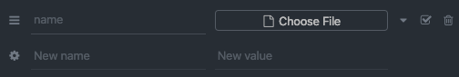

<h1 align="center">
  
</h1>

## :rocket: The project 

The goal of this project is to manage a shipping company. Is possible to register new deliveries, new delivery man and new recipients. It's also can see the shipments of a recipient and inform a problem of a shiptment.

## :construction_worker: Technologies 

For this project, we are using:

<ul>
  <li>Typescript</li>
  <li>Sequelize-typescript</li>
  <li>Express</li>
  <li>Yup</li>
</ul>

## 🛤 Routes 

### Auth
This route is used by administrators to sign in on application. To access this route, just use the following endpoint:
    
    POST /auth

The body for this request must follow this format:

    {
      "email": "admin@email.com",
      "password": "admin@password"
    }

### Recipients 

This is a **private route** and only administrators can access this path.

To list all recipients, you should access the following route:

    GET /recipients

To list a recipient, you should access the following route:

    GET /recipients/:id

To register a new recipient, you should access the following route:

    POST /recipients

The body for this request must follow this format:

    {
      "name": "Luis",
      "street": "Rua Teste 1",
      "number": 999,
      "complement": "Casa",
      "state": "SC",
      "city": "Agronômica",
      "postal_code": "89188-000"
    }

To update informations of a recipient, you should access the following route:

    PUT /recipients/:id

The body of this should be like this: 

    {
      "number" 898
    }

To delete a recipient, you should access the following route:

    DELETE /recipients/:id

### Delivery Man 

This is a **private route** and only administrators can access this path.

To list all delivery mans, you should access the following route:

    GET /deliveryman

To list a delivery man, you should access the following route:

    GET /deliveryman/:id

To register a new delivery man, you should access the following route:

    POST /deliveryman

The body for this request must follow this format:

    {
      "name": "Murilo Fernando Nascimento",
      "email": "murilo2@lta-am.com.br"
    }

To update informations of a delivery man, you should access the following route:

    PUT /deliveryman/:id

The body of this should be like this: 

    {
      "email" "murilo_nascimento@lta-am.com.br"
    }

To delete a delivery man, you should access the following route:

    DELETE /deliveryman/:id

### Delivery

This is a **private route** and only administrators can access this path.

To list all deliveries, you should access the following route:

    GET /delivery

To list a delivery, you should access the following route:

    GET /delivery/:id

To register a new delivery, you should access the following route:

    POST /delivery

The body for this request must follow this format:

    {
      "recipient_id": 3, //The id of the recipient
      "deliveryman_id": 1, //The id of the delivery man
      "product": "iPhone 11" // The name of the product
    }

To update informations of a delivery, you should access the following route:

    PUT /delivery/:id

The body of this should be like this: 

    {
      "product" "iPhone 11 Pro"
    }

To delete a delivery, you should access the following route:

    DELETE /delivery/:id

### Delivery Problems

To list all problems of a delivery, you should access the following route:

    GET /delivery/:id/problems

To register a new problem of a delivery, you should access the following route:

    POST /delivery/:id/problems

The body for this request must follow this format:

    {
      "description": "The description of the problem"
    }

Depending of the gravity of a problem, the delivery can be cancel, and the delivery man is going to receive an email about it. To cancel a delivery, you should access the following route:

    DELETE /problem/:id/cancel-delivery

PS: This is a **private route** and only administrators can access this path.

### Shipping a delivery

To start the shipping, it should access the following route: 

    PUT /delivery/:id/start

**This route does not required a body.** The start_date field is going to receive the current time.

To end the shipping, it should access the following route: 

    PUT /delivery/:id/finish

The body for this request must follow this format:

    {
      "signature_id": 1
    }

This field is the ID of the image on File table. It means that you must have to first create an image with the signature.

### File

To create a new File, you should access the following route: 

    POST /files

The body for this request should be of type Multipart Form and the key must use the name "file", like this:

<h1 align="center">
  
</h1>

### Running the project

To run this project, first you must have to install docker and after that, you must have to create your .env file, following the .env.example file. Then, execute the command:

    docker-compose up